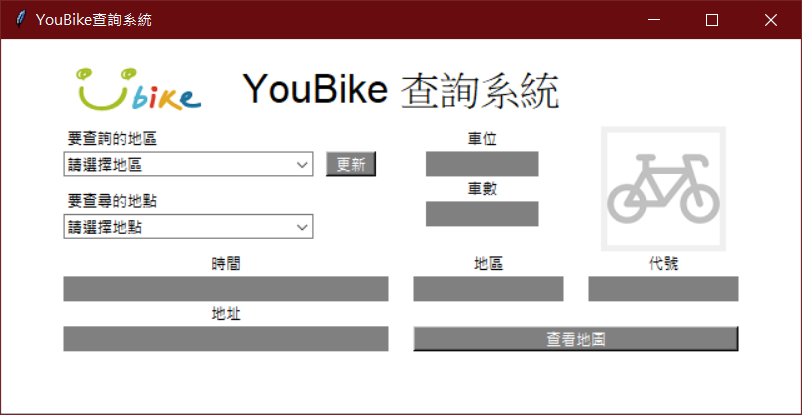

# YouBike 搜尋系統

###### 此搜尋系統提供查詢臺北YouBike、Youbike2.0、新北YouBike、桃園YouBike各站點剩餘車數


## 目錄
[專題說明]()  
[專題介紹]()


## 專題說明

### 設計背景

由課程作業 **桃園公共自行車即時服務資料** 發想，當時課程作業成果設計為輸出於consloe，且資料更是只有經過簡單分類，對使用者非常不便。  
因此想設計對使用者較為友善的介面，延伸出增加臺北市、新北市UBike資料API，可查詢各個站點剩餘車數以及連結Google Map查詢站點位置，並以視窗呈現內容。

### 設計目的
1. 改善使用者使用經驗
1. 設計友善使用者的介面
1. 圖像化站點車輛資訊
1. 簡化使用者操作

## 專題介紹

### 使用說明

1. 選擇查詢的地區
2. 選擇查詢的地點  
系統即會輸出總車位、剩餘車數、站點地區、站點代號、站點地址及上傳資料時間
3. 點擊查看地圖，至Google Map查看站點位置  

### 應用技術
* requests：下載網頁api資料
* tkinter：設計GUI
* webbbrowser：開啟網頁
* webcrawlercx

### 素材
###### 資料API來源


[YouBike2.0臺北市公共自行車即時資訊](https://data.gov.tw/dataset/137993)  
[新北市公共自行車租賃系統(YouBike)](https://data.ntpc.gov.tw/datasets/71CD1490-A2DF-4198-BEF1-318479775E8A)  
[YouBike臺北市公共自行車即時資訊](https://data.gov.tw/dataset/128706)  
[桃園公共自行車即時服務資料](https://data.tycg.gov.tw/opendata/datalist/datasetMeta?oid=5ca2bfc7-9ace-4719-88ae-4034b9a5a55c)


### Requirement

```py
import random

import tkinter
from tkinter import *
import requests
import webbrowser
```

